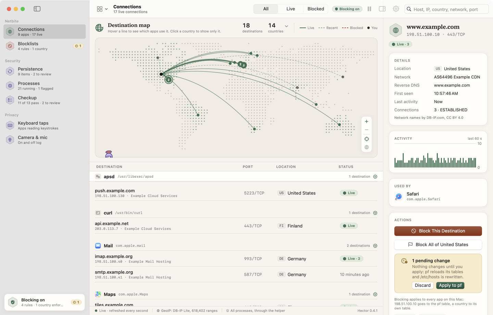
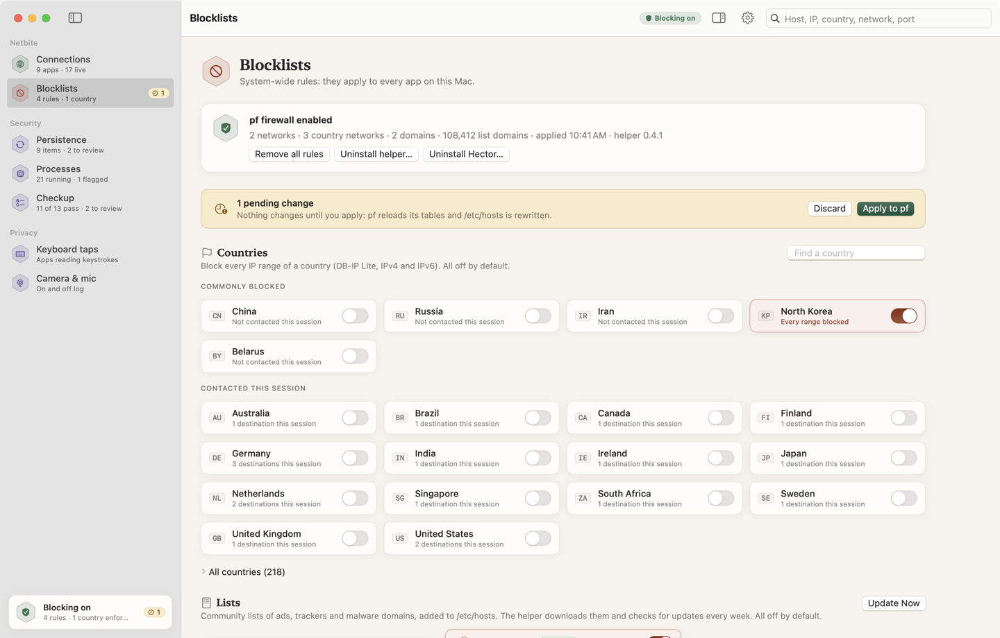
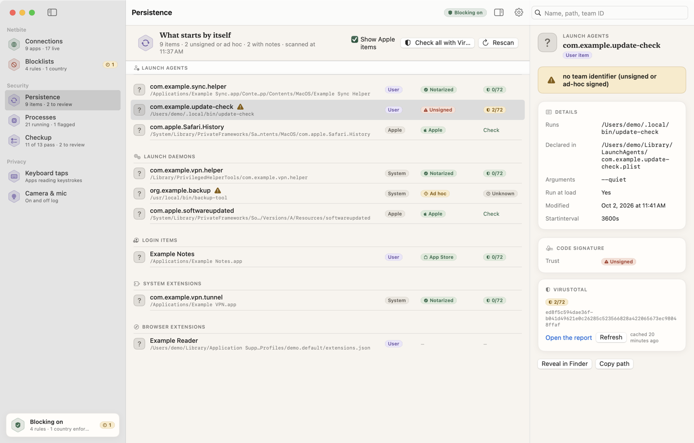
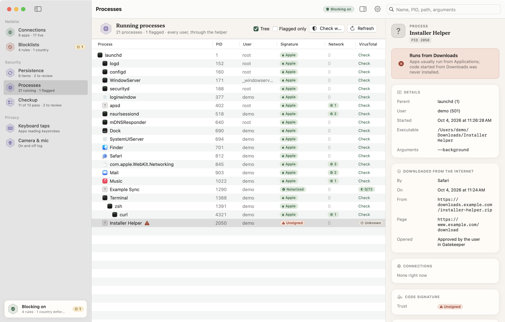
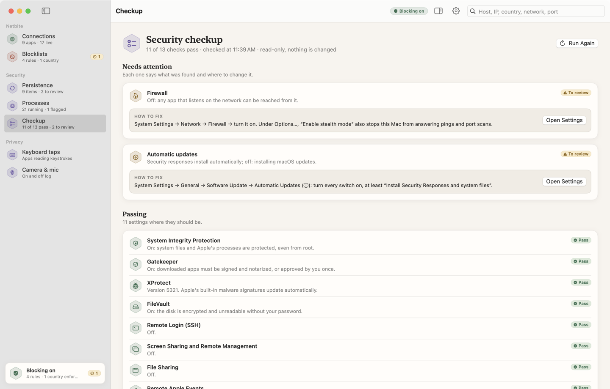

<p align="center">
  
</p>

<h1 align="center">
  <picture>
    <source media="(prefers-color-scheme: dark)" srcset="docs/images/hector-wordmark-dark.png">
    
  </picture>
</h1>

<p align="center">
  <strong>A calm guardian for your Mac: see what runs, what starts by itself, and who it talks to, then cut it off.</strong>
</p>

<p align="center">
  macOS 15+ · Apple silicon and Intel · Swift 6 · GPL-3.0 · no account, no telemetry
</p>

Hector is an open-source security app for macOS, in the spirit of Objective-See's tools ([LuLu](https://objective-see.org/products/lulu.html), [KnockKnock](https://objective-see.org/products/knockknock.html), [TaskExplorer](https://objective-see.org/products/taskexplorer.html), [ReiKey](https://objective-see.org/products/reikey.html)) and [Little Snitch](https://www.obdev.at/products/littlesnitch/), built to run **without a paid Apple Developer account**. He is named after the defender of Troy: the one who stands on the walls and keeps watch. He does not shout. He looks, tells you what he saw, and lets you decide.

<p align="center">
  <picture>
    <source media="(prefers-color-scheme: dark)" srcset="docs/images/connections-dark.png">
    
  </picture>
</p>

<p align="center"><sub>Every screenshot shows the app's demo mode: documentation IP ranges, <code>example.com</code> hosts and made-up apps.</sub></p>

> **Status: early development (0.4).** Hector was called Netbite up to 0.3; updating replaces the old helper and keeps your blocklist, data and VirusTotal key. See the [roadmap](docs/ROADMAP.md).

## What Hector watches

### Netbite, the network

Netbite is the network module: which app talks to which server, where that server is, and a way to cut it off.

- **Live connections per app.** Apps and their destinations, refreshed every second. Helper processes are grouped under their app; with the helper installed, system daemons show up too. The data comes from libproc, the same source `lsof -i` uses.
- **An interactive world map.** One line per destination, solid while live, dashed when recent, clay when blocked. Hover a line to see which app owns it, click a country to show only it, zoom and pan.
- **Country and network names, offline.** The country of every address from the free [DB-IP Lite](https://db-ip.com/db/download/ip-to-country-lite) database, and, if you want it, the network that owns it ("AS15169 Google LLC") from [DB-IP IP to ASN Lite](https://db-ip.com/db/download/ip-to-asn-lite). Lookups never leave your Mac. The details panel adds reverse DNS and the last minute of activity.
- **Blocking, for the whole Mac.** "Block This Destination", "Block All of <country>", or your own rules for a domain, an address or a network. The `hectord` helper enforces them with pf (the macOS firewall) and `/etc/hosts`, and re-applies them at boot. Nothing changes until you press Apply. Country blocking is opt-in, networks wider than /8 (IPv4) or /16 (IPv6) are refused, and local networks are never blocked.
- **Hosts lists.** Subscribe to [StevenBlack Unified](https://github.com/StevenBlack/hosts) (ads and malware) or [EasyPrivacy](https://easylist.to) (trackers), about 110,000 domains together, off by default. The helper downloads them from fixed HTTPS addresses, validates every line, keeps them apart from your own rules, and checks for updates weekly.

<p align="center">
  <picture>
    <source media="(prefers-color-scheme: dark)" srcset="docs/images/blocklists-dark.png">
    
  </picture>
</p>

### Security

- **Persistence.** Everything set to start by itself: launch agents and daemons, login items and background tasks (through the helper), cron and periodic jobs, system and kernel extensions, configuration profiles, browser extensions. Each with its code signature, and a note on anything odd.
- **Processes.** What runs right now, as a tree or a flat list: user, arguments, signature, connections. Code running from a temporary, Downloads or hidden folder, or deleted after launch, is flagged; downloads show where they came from.
- **VirusTotal hash lookups.** For one item or all of them, within the free tier (4 per minute, 500 per day), cached for 7 days. Only the SHA-256 leaves your Mac, never the file. The key is yours and stays in your Keychain (Settings, ⌘,).
- **Security checkup.** SIP, Gatekeeper, XProtect, FileVault, the firewall, automatic updates, Remote Login, Screen Sharing and Remote Management, File Sharing, Remote Apple Events, automatic login, the guest account and MDM enrollment. Each says what was found and how to fix it, with a button to the right System Settings pane. Read-only, no root, no password.

<table>
  <tr>
    <td width="50%">
      <picture>
        <source media="(prefers-color-scheme: dark)" srcset="docs/images/persistence-dark.png">
        
      </picture>
    </td>
    <td width="50%">
      <picture>
        <source media="(prefers-color-scheme: dark)" srcset="docs/images/processes-dark.png">
        
      </picture>
    </td>
  </tr>
  <tr>
    <td width="50%"><sub><b>Persistence.</b> What starts by itself, who signed it, what VirusTotal knows.</sub></td>
    <td width="50%"><sub><b>Processes.</b> A program started from Downloads, and where it was downloaded from.</sub></td>
  </tr>
</table>

<p align="center">
  <picture>
    <source media="(prefers-color-scheme: dark)" srcset="docs/images/checkup-dark.png">
    
  </picture>
</p>

### Privacy

- **Keyboard taps.** Every app that intercepts keystrokes through an event tap: whether it can change them or only listen, whether it sees every app or one, and who signed it. Read from the public event tap list, with no permission.
- **Camera and microphone.** A live "in use now" view, and a log of every time a camera or an audio input turns on or off, with the app recording from the microphone. Which app uses a camera is not shown: macOS has no public way to tell. Hector never opens a device, so no permission is asked.

### The `hector` command line

Everything above is also in `hector`: `connections`, `geo`, `rules`, `lists`, `helper`, `persistence`, `processes`, `checkup`, `taps`, `devices`, `sign`, `vt`. See [Usage](#usage).

### Honest about limits

The no-paid-account constraint shapes what the network module can do:

| | Hector (Netbite) | LuLu / Little Snitch |
|---|---|---|
| Which app connects to which IP, port, country | ✅ per process | ✅ |
| World map of destinations | ✅ | Little Snitch |
| Block a domain, IP, network or a whole country | ✅ **system-wide**, through `pf` and `/etc/hosts` | ✅ |
| Block a destination for **one app only** | ❌ needs a signed Network Extension | ✅ |
| Prompt on every new connection | ❌ same reason | ✅ |

Hector *observes per app* and *blocks for the whole Mac*. The [architecture notes](docs/ARCHITECTURE.md) explain why.

## Install

Download the latest `Hector-x.y.z-macOS.zip` from [Releases](../../releases), move **Hector.app** to Applications, and open it. The release notes explain the one-time Gatekeeper step: Hector is not notarized, because notarization needs a paid Apple Developer account.

To block, install the helper from the Blocklists screen; macOS asks for an administrator password once. Without it, Hector observes your own apps and blocks nothing.

## Requirements

- macOS 15 or later (Apple silicon or Intel)
- Swift 6: Xcode 16 or later, or the matching Command Line Tools

## Build and test

```bash
swift build -c release
```

```bash
scripts/test.sh
```

`scripts/test.sh` runs `swift test`, adding the Swift Testing plugin path that SwiftPM forgets when only the Command Line Tools are installed.

The binary is `.build/release/hector`.

To build the app as `Hector.app`, ad-hoc signed (no developer account needed), then open it:

```bash
scripts/bundle-app.sh
```

```bash
open .build/Hector.app
```

During development, `swift run HectorApp` starts the app without bundling it. Debug builds also have a demo mode with sample data, `HECTOR_DEMO=1 swift run HectorApp`, which `scripts/readme-images.sh` uses to render the images of this page; [CONTRIBUTING.md](CONTRIBUTING.md) lists the other debug switches.

If `swift build` crashes with `Symbol not found … BuildServerProtocol`, or complains that the SDK is not supported by the compiler, your Command Line Tools do not match their own SDK (Command Line Tools 26.6 ships that way). Install Command Line Tools for Xcode 27 or later, or Xcode. Until then, `scripts/build.sh` builds the CLI with `swiftc` directly, picking an SDK the compiler can load. Tests still need SwiftPM.

```bash
scripts/build.sh
```

That one writes `.build/manual/hector`.

## Usage

```bash
hector connections
```

```text
Example Browser  com.example.browser  (pid 4321)
  ├ udp 198.51.100.20:443                           US
  ├ tcp 203.0.113.7:443                             DE   ESTABLISHED
  └ tcp [2001:db8::25]:5228                         --   ESTABLISHED
```

As a normal user you see your own processes. Run it with `sudo` to include system daemons. Add `--resolve` for reverse DNS, `--asn` for the network that owns each address, `--json` for machine-readable output, and `--all` to include listening sockets.

```bash
hector checkup
```

Reviews the security settings of this Mac and prints how to fix each one that needs it. It only reads; `--json` for scripts.

```bash
hector geo update
```

Downloads the country database to `~/Library/Application Support/Hector/`.

```bash
hector geo lookup 140.82.121.4
```

```bash
hector geo update --asn
```

Downloads the network names (ASN) database next to the country one.

```bash
hector geo asn 140.82.121.4
```

```bash
hector geo ranges CN --count
```

```bash
hector rules example > blocklist.json
```

Edit the file: add rules, list the countries to block in `"blockedCountries"` (for example `["CN", "RU"]`), and the hosts lists to subscribe to in `"hostsLists"` (for example `["stevenblack-unified", "easyprivacy"]`; `hector lists` shows the catalog).

```bash
hector rules check blocklist.json
```

```bash
hector rules render blocklist.json --out ./out
```

`rules render` writes the pf ruleset, the two tables and the resulting hosts file into `./out` and prints the commands the helper will run. **It changes nothing on your system.** Hosts lists are downloaded by the helper; add `--fetch-lists` to `check` or `render` to download them now and include them.

Once the helper is installed (from the app, or with `sudo hectord install`), the CLI can drive it too:

```bash
hector helper apply blocklist.json
```

```bash
hector helper status
```

```bash
hector helper flush
```

`flush` removes every Hector rule and the managed `/etc/hosts` section; the helper stays installed.

```bash
hector lists
```

```bash
hector lists refresh
```

`lists` shows the catalog, your subscriptions and the helper's copies (domains, last update, errors); `refresh` asks the helper to download them now. `hector lists fetch stevenblack-unified` downloads and validates a list as you, without applying anything.

## Uninstall

Choose **Hector → Uninstall Hector…** in the menu bar. It removes, after one administrator password:

- every blocking rule (the pf anchor, its pf reference, the Netbite section of `/etc/hosts`);
- the helper, its LaunchDaemon, its data in `/Library/Application Support/Hector`, its logs in `/Library/Logs/Hector` and its authorization right;
- your blocklist, the country database, preferences, caches and saved window state in your Library;
- the VirusTotal API key in your Keychain, if you saved one;
- the app itself, moved to the Trash.

Without the app: `sudo /Library/PrivilegedHelperTools/io.github.0xrd.hectord uninstall --purge`, then delete `~/Library/Application Support/Hector`.

To check that nothing is left, without root: `scripts/check-uninstall.sh`.

## Privacy

Hector has no telemetry, no account and no server. Everything stays on your Mac. It makes only these network requests: the DB-IP database downloads (countries, and network names if you want them), when you start them from the CLI (`hector geo update`, `hector geo update --asn`) or the app; the hosts lists you subscribe to, downloaded by the helper from GitHub when you apply them and checked weekly (a conditional request that usually transfers nothing); and reverse DNS lookups of the addresses your apps already contact, through your system resolver. The starting point of the map is the region set in macOS, not a location lookup.

## Project layout

```
Sources/HectorCore/   Library shared by the CLI, the app and the helper
  Net/                 IPAddress, CIDR
  Collector/           Socket enumeration per process (libproc)
  GeoIP/               DB-IP loaders (countries, network names), lookups, range → CIDR conversion, updaters
  Rules/               Blocklist model, compiler, pf anchor and /etc/hosts rendering, hosts lists
                       (catalog, parser, downloader)
  Privacy/             Keyboard event taps, camera and microphone state and log
Sources/hector/       Command-line tool
Sources/HectorApp/    SwiftUI app: live monitor, world map, details panel, blocklists
Sources/hectord/      Privileged helper (root): enforces blocklists with pf and /etc/hosts
Tests/HectorCoreTests Swift Testing suites
docs/                  Architecture and roadmap
scripts/test.sh        swift test, working around Command Line Tools without Xcode
scripts/check-uninstall.sh
                       Lists anything Hector left on this Mac
scripts/build.sh       swiftc-only build of the CLI, for broken toolchains
scripts/bundle-app.sh  Builds and ad-hoc signs .build/Hector.app (--universal, --zip)
.github/workflows/     CI on every push, release on every v* tag
scripts/generate-world-data.py
                       Regenerates the map data from Natural Earth
scripts/readme-images.sh
                       Renders the logo and the screenshots in docs/images (demo data)
```

## Security

The helper runs as root. [SECURITY.md](SECURITY.md) describes the threat model, the review done before 0.3, the remaining risks, and how to report a vulnerability privately.

## Contributing

Issues and pull requests are welcome. Please read [CONTRIBUTING.md](CONTRIBUTING.md) first.

## License

Hector is free software, released under the [GNU General Public License v3.0](LICENSE).

IP geolocation and network names (IP to ASN Lite) by [DB-IP](https://db-ip.com), licensed under [CC BY 4.0](https://creativecommons.org/licenses/by/4.0/). The databases are downloaded at runtime and are not redistributed in this repository.

Map data derived from [Natural Earth](https://www.naturalearthdata.com) (public domain).
